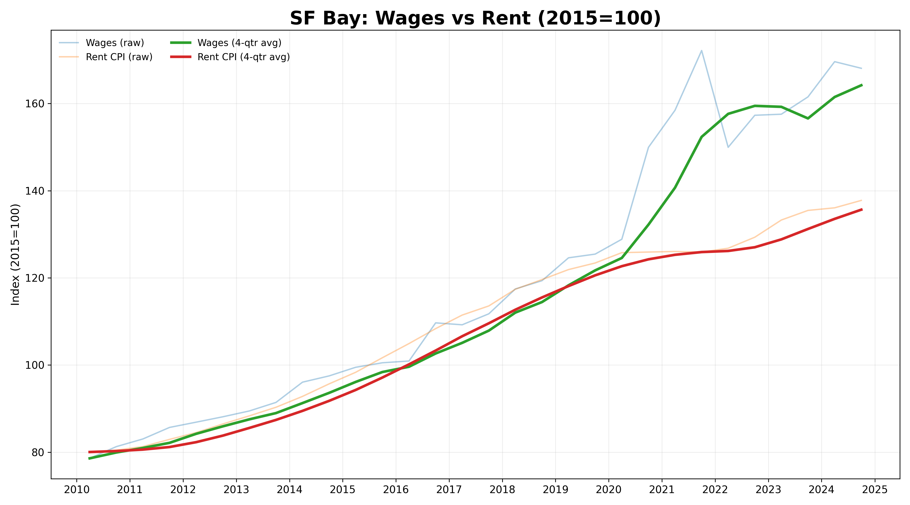
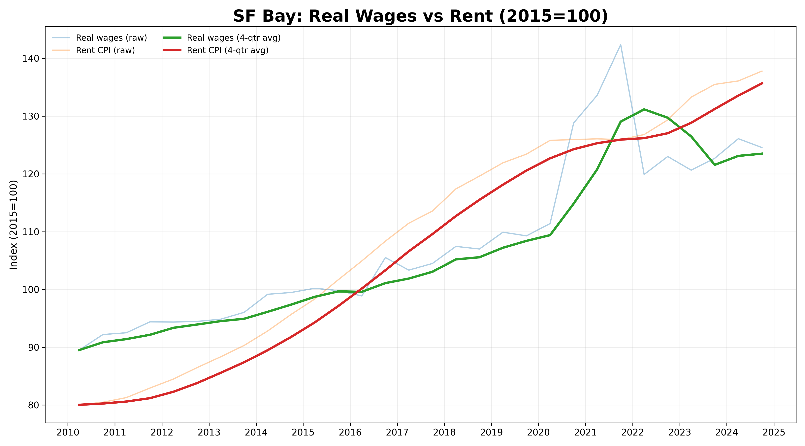

# Bay Area Wages vs Rent (2015=100)

**Headline (2015 → [latest date])**
- **Wages:** [W]%
- **Rent CPI:** [R]%
- **Real wages:** [RW]%
- **Wage-to-rent index:** [WR]%

**One-page brief:** [artifacts/brief.pdf](artifacts/brief.pdf)

## Figures

## Data & Notebook
- Dataset: [data/sf_quarterly_wage_rent.csv](data/sf_quarterly_wage_rent.csv)  
- Notebook: [analysis_portfolio.ipynb](analysis_portfolio.ipynb)

## Methods (short)
- Wages: BLS QCEW (FRED series `ENUC418640510SA`).  
- Prices: CPI-U All Items (`CUUSA422SA0`) & Rent of Primary Residence (`CUUSA422SEHA`).  
- Monthly CPI averaged to **quarters**; wages are quarterly. Both indexed to **2015-01-01 = 100**.  
- Affordability measures: **real wages** (deflated by local CPI) and **wage-to-rent ratio**.

## Notes
- CPI-Rent is a renters’ price index (not listing medians).  
- QCEW wages can spike with bonuses/stock. Results are descriptive, not causal.
